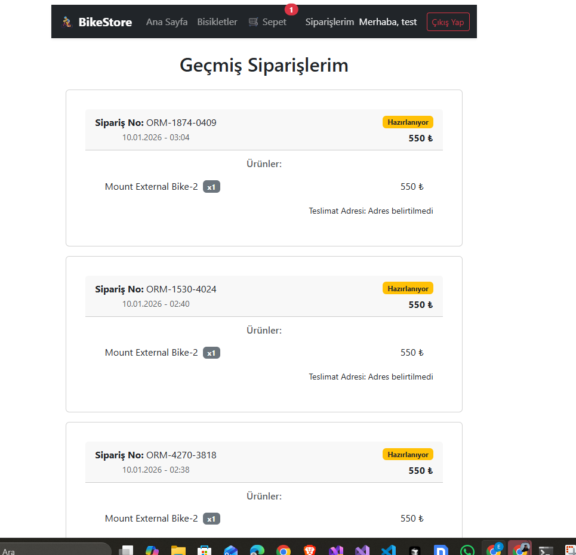
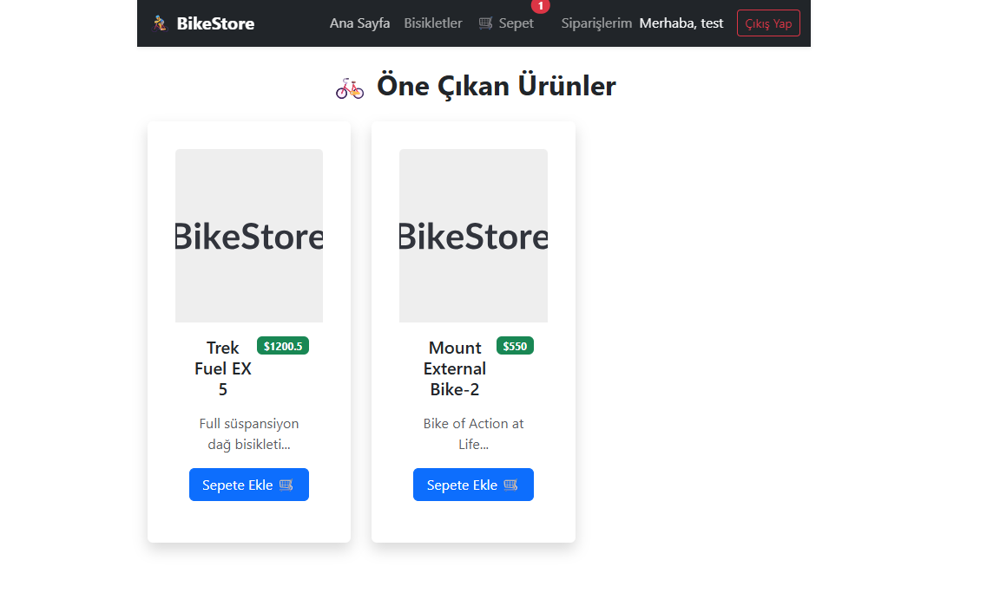
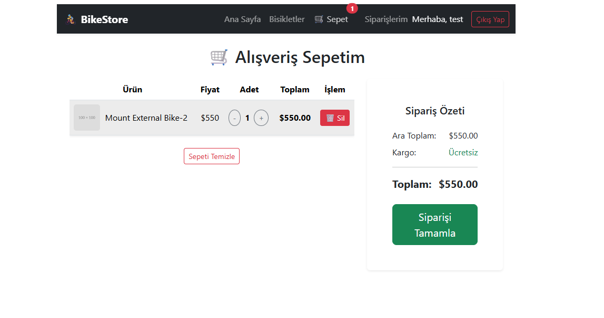

#  🚴 BikeStore E-Commerce Application

#### Bu proje, modern yazılım mimarileri kullanılarak geliştirilmiş, **Full-Stack** bir e-ticaret uygulamasıdır. Kullanıcılara ürün inceleme, sepete ekleme (hem yerel hem veritabanı senkronizasyonlu) ve sipariş verme deneyimi sunar.


## 🚀 Özellikler (Features)


### Backend (.NET Core API)

*N-Tier Architecture:* Katmanlı mimari yapısı (Core, Data, Service, API).

 *Generic Repository Pattern:* Veri erişiminde soyutlama ve kod tekrarını önleme.

*JWT Authentication:* Güvenli kimlik doğrulama ve yetkilendirme.

*Entity Framework Core:* Code-First yaklaşımı ile veritabanı yönetimi.

*Hybrid Cart Logic:* Sepet verisi hem veritabanında saklanır hem de performans için yönetilir.

*DTO (Data Transfer Objects):* Veri bütünlüğü ve güvenliği için modeller arası taşıma.

### Frontend (React + Vite)

*Context API:* Global State yönetimi (CartContext, AuthContext).

*Axios Interceptors:* HTTP isteklerinde otomatik Token yönetimi.

*LocalStorage Sync:* Oturum kapalıyken bile sepetin korunması.

*Responsive UI:* Bootstrap ile mobil uyumlu tasarım.

*Protected Routes:* Giriş yapmamış kullanıcıların erişimini kısıtlama.

## 🛠️ Teknolojiler (Tech Stack)

*Backend:* ASP.NET Core Web API, C#, SQL Server

*Frontend:* React.js, Vite, Bootstrap 5

*Veritabanı:* MSSQL (Microsoft SQL Server)

*Araçlar:* Visual Studio, VS Code, Swagger UI, Postman

## 📸 Ekran Görüntüleri (Screenshots)

### 
## 
# 

# ⚙️ Kurulum (Installation)

## Projeyi yerel ortamınızda çalıştırmak için aşağıdaki adımları izleyin:

### 1. Ön Gereksinimler

* .NET 10.0 SDK (veya üzeri)

* Node.js \& npm

* SQL Server

### 2. Backend Kurulumu
```bash

# cd BikeStoreWeb.API

# appsettings.json dosyasındaki "ConnectionStrings" alanını kendi SQL sunucunuza göre düzenleyin.

# dotnet restore

# dotnet ef database update  # Veritabanını oluşturur ve tabloları açar

# dotnet run


### 3. Frontend Kurulumu
# cd BikeStoreWeb.UI
# npm install
# npm run dev

### 📝 Veritabanı Yapısı (Database)
    Proje Code-First yaklaşımıyla geliştirilmiştir. Update-Database komutu ile tablolar otomatik oluşturulur.

* Users: Kullanıcı bilgileri.

* Products: Ürün ve stok bilgileri.

* Orders & OrderItems: Sipariş geçmişi.

* ShoppingCartItems: Kalıcı sepet verisi
````
